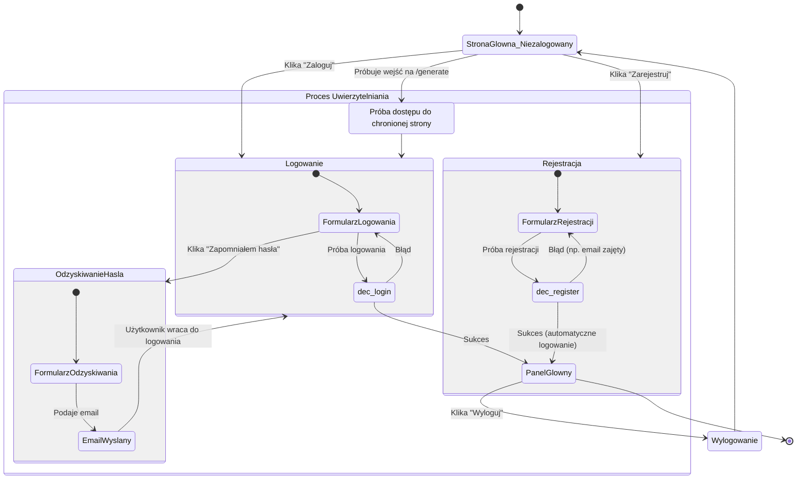

<mermaid_diagram>

```mermaid
stateDiagram-v2
    [*] --> StronaGlowna_Niezalogowany

    state StronaGlowna_Niezalogowany: Strona Główna (dla gości)
    StronaGlowna_Niezalogowany --> Logowanie: Klika "Zaloguj"
    StronaGlowna_Niezalogowany --> Rejestracja: Klika "Zarejestruj"
    StronaGlowna_Niezalogowany --> ProbaDostepuChronionej: Próbuje wejść na /generate

    state "Proces Uwierzytelniania" as AuthProcess {
        state Logowanie {
            [*] --> FormularzLogowania
            FormularzLogowania --> OdzyskiwanieHasla: Klika "Zapomniałem hasła"
            FormularzLogowania --> dec_login: Próba logowania
            state dec_login <<choice>>
            dec_login --> PanelGlowny: Sukces
            dec_login --> FormularzLogowania: Błąd
        }

        state Rejestracja {
            [*] --> FormularzRejestracji
            FormularzRejestracji --> dec_register: Próba rejestracji
            state dec_register <<choice>>
            dec_register --> PanelGlowny: Sukces (automatyczne logowanie)
            dec_register --> FormularzRejestracji: Błąd (np. email zajęty)
        }

        state OdzyskiwanieHasla {
            [*] --> FormularzOdzyskiwania
            FormularzOdzyskiwania --> EmailWyslany: Podaje email
            EmailWyslany --> Logowanie: Użytkownik wraca do logowania
        }

        ProbaDostepuChronionej: Próba dostępu do chronionej strony
        ProbaDostepuChronionej --> Logowanie
    }

    state PanelGlowny: Panel Główny (Zalogowany)
    PanelGlowny --> Wylogowanie: Klika "Wyloguj"
    Wylogowanie --> StronaGlowna_Niezalogowany

    PanelGlowny --> [*]
```
</mermaid_diagram>
