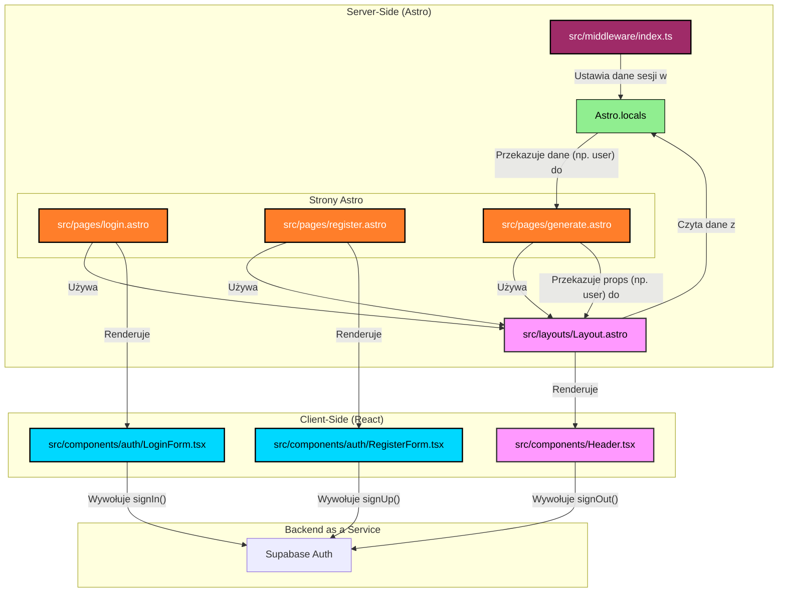

<mermaid_diagram>

```mermaid
flowchart TD
    classDef astroPage fill:#FF7E2A,stroke:#000,stroke-width:2px,color:#fff;
    classDef reactComp fill:#00D8FF,stroke:#000,stroke-width:2px,color:#000;
    classDef layout fill:#FFE458,stroke:#000,stroke-width:2px,color:#000;
    classDef middleware fill:#9F2B68,stroke:#000,stroke-width:2px,color:#fff;
    classDef data fill:#90EE90,stroke:#000,stroke-width:1px,color:#000;
    classDef updated fill:#f9f,stroke:#333,stroke-width:2px;

    subgraph "Server-Side (Astro)"
        MW[src/middleware/index.ts]:::middleware
        Locals[Astro.locals]:::data
        L[src/layouts/Layout.astro]:::layout

        subgraph "Strony Astro"
            direction TB
            Page_Login[src/pages/login.astro]:::astroPage
            Page_Register[src/pages/register.astro]:::astroPage
            Page_Generate[src/pages/generate.astro]:::astroPage
        end
    end

    subgraph "Client-Side (React)"
        Comp_Header[src/components/Header.tsx]:::reactComp
        Comp_LoginForm[src/components/auth/LoginForm.tsx]:::reactComp
        Comp_RegisterForm[src/components/auth/RegisterForm.tsx]:::reactComp
    end
    
    subgraph "Backend as a Service"
        Supabase[Supabase Auth]
    end

    MW -- "Ustawia dane sesji w" --> Locals
    
    Page_Login -- "Używa" --> L
    Page_Register -- "Używa" --> L
    Page_Generate -- "Używa" --> L
    
    L -- "Czyta dane z" --> Locals
    L -- "Renderuje" --> Comp_Header
    
    Page_Login -- "Renderuje" --> Comp_LoginForm
    Page_Register -- "Renderuje" --> Comp_RegisterForm
    
    Locals -- "Przekazuje dane (np. user) do" --> Page_Generate
    Page_Generate -- "Przekazuje props (np. user) do" --> L

    Comp_Header -- "Wywołuje signOut()" --> Supabase
    Comp_LoginForm -- "Wywołuje signIn()" --> Supabase
    Comp_RegisterForm -- "Wywołuje signUp()" --> Supabase

    class L,Comp_Header updated;
```
</mermaid_diagram>
