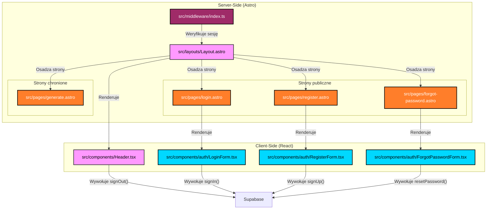

<mermaid_diagram>

```mermaid
flowchart TD
    classDef astroPage fill:#FF7E2A,stroke:#000,stroke-width:2px,color:#fff;
    classDef reactComp fill:#00D8FF,stroke:#000,stroke-width:2px,color:#000;
    classDef layout fill:#FFE458,stroke:#000,stroke-width:2px,color:#000;
    classDef middleware fill:#9F2B68,stroke:#000,stroke-width:2px,color:#fff;
    classDef updated fill:#f9f,stroke:#333,stroke-width:2px;

    subgraph "Server-Side (Astro)"
        MW[src/middleware/index.ts]:::middleware
        L[src/layouts/Layout.astro]:::layout
        
        subgraph "Strony publiczne"
            direction TB
            LoginPage[src/pages/login.astro]:::astroPage
            RegisterPage[src/pages/register.astro]:::astroPage
            ForgotPage[src/pages/forgot-password.astro]:::astroPage
        end
        
        subgraph "Strony chronione"
            direction TB
            GeneratePage[src/pages/generate.astro]:::astroPage
        end
    end

    subgraph "Client-Side (React)"
        Header[src/components/Header.tsx]:::reactComp
        LoginForm[src/components/auth/LoginForm.tsx]:::reactComp
        RegisterForm[src/components/auth/RegisterForm.tsx]:::reactComp
        ForgotForm[src/components/auth/ForgotPasswordForm.tsx]:::reactComp
    end
    
    MW -- "Weryfikuje sesję" --> L
    L -- "Osadza strony" --> LoginPage
    L -- "Osadza strony" --> RegisterPage
    L -- "Osadza strony" --> ForgotPage
    L -- "Osadza strony" --> GeneratePage

    L -- "Renderuje" --> Header

    LoginPage -- "Renderuje" --> LoginForm
    RegisterPage -- "Renderuje" --> RegisterForm
    ForgotPage -- "Renderuje" --> ForgotForm
    
    Header -- "Wywołuje signOut()" --> Supabase
    LoginForm -- "Wywołuje signIn()" --> Supabase
    RegisterForm -- "Wywołuje signUp()" --> Supabase
    ForgotForm -- "Wywołuje resetPassword()" --> Supabase

    class L,Header updated;
```
</mermaid_diagram>
